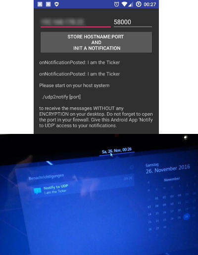

# Notify2Udp

Grab Notifications and send them PLAIN via WiFi to a device (IP and Port) in your LAN.
A small daemon get them and send them to GNOME, KDE, Unity or xfce.

Signed Apk: [Notify to UDP](../../raw/master/app/app-release.apk)
