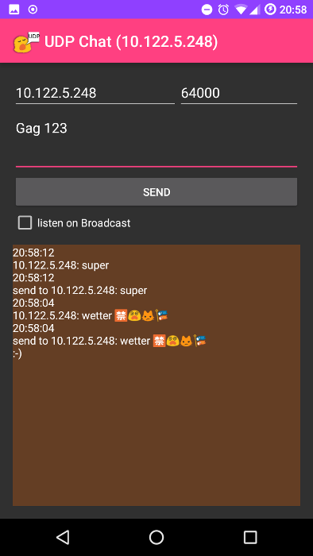

# UDP Chat

send a text via UDP to ip+port or just port (leave ip address free and it will be send as broadcast).
Listen on a port and get messages via UDP.

## App Icon

## Get the App

You can get a signed APK from here (Android 4.1+): [APK](https://raw.githubusercontent.com/no-go/Notify2UDP/udpChat/app/app-release.apk)
